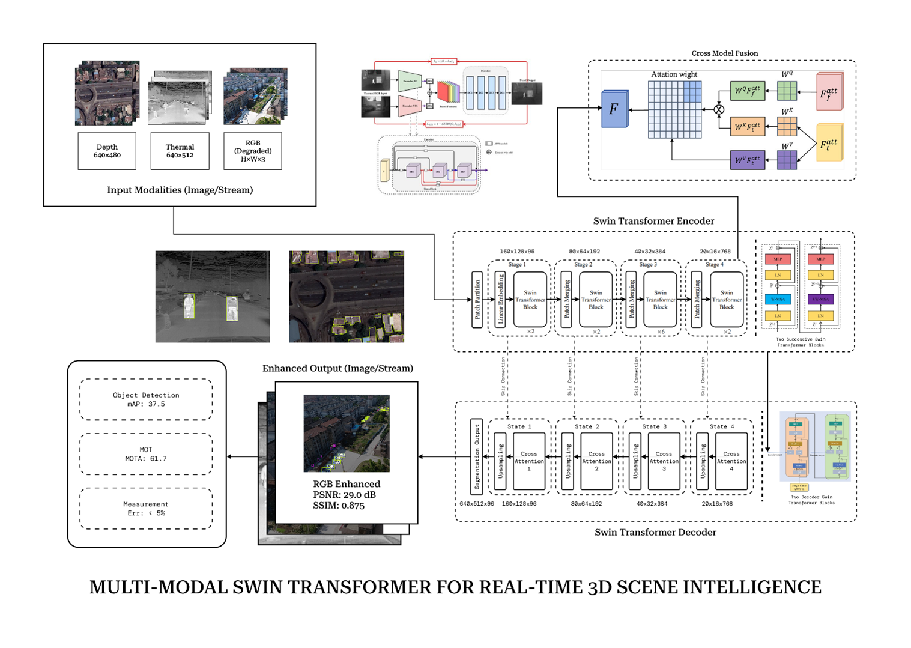

# ReconMMT

**ReconMMT** stands for **Reconstruction using a Multi-Modal Transformer for real-time geospatial scene understanding and sensing**.

This repository contains the research implementation and supporting project assets for a multi-modal aerial perception framework designed for degraded-environment UAV operations. The proposed system integrates synchronized **RGB**, **thermal**, and **depth** sensing to reconstruct visually enhanced scene representations while supporting downstream geospatial understanding tasks such as object analysis, tracking-oriented perception, and metric scene interpretation.

<div align="center">


</div>

## Overview

ReconMMT is motivated by a central challenge in aerial vision: single-modality perception degrades significantly under low illumination, haze, fog, smoke, radiometric inconsistency, and partial occlusion. Conventional pipelines often treat image enhancement and scene understanding as separate stages, which can limit robustness in real-time field deployment. ReconMMT addresses this by combining modality-specific feature extraction with transformer-based multi-modal fusion to recover structurally consistent and information-rich scene representations.

The repository is organized as a research-codebase for experimentation, model training, testing, inference, and export. Prototype applications inside `apps/web` and `apps/api` are kept separate from the core research implementation.

## Research Contributions

- A multi-modal reconstruction framework that jointly uses RGB, thermal, and depth observations.
- Cross-modal feature fusion with a transformer bottleneck for robust scene restoration.
- Reconstruction-oriented training with synchronized augmentation to preserve correspondence across sensing modalities.
- A research workflow for training, evaluation, checkpointing, inference, and ONNX export.
- A codebase aligned with the project’s final-year/research-paper direction and accompanying documentation in `.docs/`.

## Method Summary

ReconMMT follows a multi-stage reconstruction strategy:

1. **Modality-specific encoding** extracts hierarchical features from RGB, thermal, and depth inputs.
2. **Cross-modal fusion** combines complementary cues across sensing streams.
3. **Transformer bottleneck reasoning** aggregates high-level contextual information for reconstruction.
4. **Hierarchical decoding** reconstructs an enhanced RGB representation suitable for downstream aerial analysis.

The current implementation also includes synchronized augmentation strategies appropriate for paired multi-modal data, including spatial transformations and degradation-aware RGB perturbations.

## Repository Structure

```text
.
|-- main.py
|-- train.py
|-- test.py
|-- models/
|   `-- algo.py
|-- data/
|-- results/
|-- visualization/
|-- .docs/
|-- apps/
|   |-- web/
|   `-- api/
`-- Makefile
```

Key files:

- [main.py](./main.py): unified command entrypoint for smoke testing, inference, export, and delegated train/test execution.
- [train.py](./train.py): model training script for ReconMMT.
- [test.py](./test.py): evaluation script for validation or test splits.
- [models/algo.py](./models\algo.py): model definition, dataset handling, augmentation, losses, metrics, and export helpers.
- [.docs](./.docs): supporting report and paper material used for project context.

## Dataset Format

ReconMMT expects paired multi-modal samples with aligned file stems across modalities:

```text
data/
  train/
    rgb/
    thermal/
    depth/
    target/
  val/
    rgb/
    thermal/
    depth/
    target/
  test/
    rgb/
    thermal/
    depth/
    target/
```

Example:

```text
data/train/rgb/frame_001.png
data/train/thermal/frame_001.png
data/train/depth/frame_001.png
data/train/target/frame_001.png
```

## Installation

Use Python 3.10 or newer.

Install the core dependencies:

```bash
python -m pip install --upgrade pip
python -m pip install torch torchvision pillow onnx
```

Or use the provided helper target:

```bash
make install
```

Additional setup notes are provided in [INSTALL](./INSTALL).

## Usage

Compile check:

```bash
make compile
```

Smoke test:

```bash
make smoke
```

Training:

```bash
make train DATA_ROOT=data IMAGE_SIZE=256 BATCH_SIZE=4 EPOCHS=30 OUTPUT_DIR=results/reconmmt
```

Evaluation:

```bash
make test DATA_ROOT=data CHECKPOINT=results/reconmmt/best_reconmmt.pt IMAGE_SIZE=256 BATCH_SIZE=4
```

Single-sample inference:

```bash
make infer \
  CHECKPOINT=results/reconmmt/best_reconmmt.pt \
  RGB=data/test/rgb/frame_001.png \
  THERMAL=data/test/thermal/frame_001.png \
  DEPTH=data/test/depth/frame_001.png \
  OUTPUT=results/reconmmt/infer_frame_001.png
```

ONNX export:

```bash
make export CHECKPOINT=results/reconmmt/best_reconmmt.pt OUTPUT_DIR=results/reconmmt
```

## Implementation Notes

- The research implementation is centered on the `ReconMMT` model and its reconstruction objective.
- Training includes synchronized augmentation so spatial alignment is preserved across modalities.
- Evaluation reports reconstruction metrics including loss, PSNR, SSIM, and MAE.
- Prototype application code inside `apps/web` and `apps/api` is intentionally not the focus of this README.

## Citation

If this repository is used in academic or project work, cite the associated report or paper once the final citation format is available.

```text
ReconMMT: Reconstruction using a Multi-Modal Transformer for real-time geospatial scene understanding and sensing.
```

## Copyright and License

Copyright (c) Gautam Ankoji.

This project is released under the MIT License. See [LICENSE](./LICENSE) for details.
